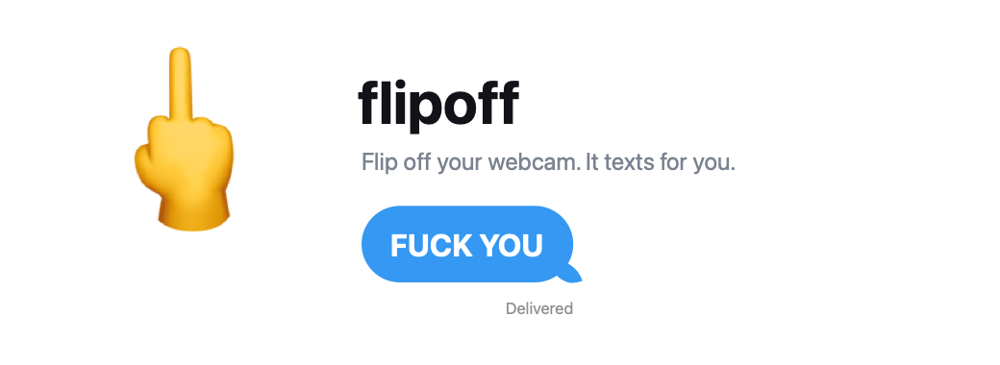
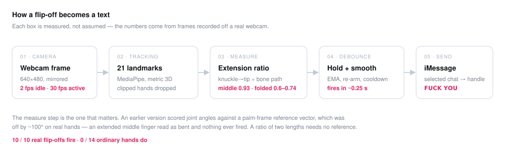
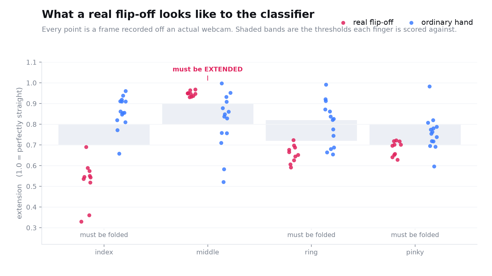

# flipoff



Sings the message out loud the instant it sees the gesture, then sends
**𝗙𝗨𝗖𝗞 𝗬𝗢𝗨** — bold, uppercase — to whichever iMessage conversation you
have open.



```
./flipoff                        # run it
./flipoff --tune                 # camera window + live score, sends nothing
./flipoff --to "Jane Doe"        # pin one person instead
./flipoff -m "hey" --effect none # different message, no animation
./test_gesture.py                # the suite
```

First run fetches `hand_landmarker.task` (7.8MB) beside the script. Nothing else
is installed.

## How it decides

MediaPipe Tasks `HandLandmarker` scored off **`hand_world_landmarks`** — metric
3D, not the normalized 2D ones. That matters because the natural way to flip off
a webcam points the finger straight down the camera axis, where a 2D projection
foreshortens it into something that looks curled.

Each finger is measured by **extension**: straight-line knuckle-to-tip divided by
the length of the bone path. 1.0 is straight, ~0.35 is a clenched fist. It needs
no reference frame, so hand orientation and metacarpal geometry can't skew it.



Every number below came off a real webcam, not a model:

| finger | in a real flip-off |
|---|---|
| **middle** | **0.93 – 0.97** |
| ring / pinky | 0.59 – 0.74 |
| index | 0.33 – 0.59 |

The score is `min()` over four constraints — middle extended, and index / ring /
pinky each folded — so one straight finger sinks it. Each is a smooth ramp, not a
cutoff, because real flip-offs are sloppy.

Three deliberate asymmetries:

- **Folded means folded.** The bands start at 0.80, not 0.90. A merely *relaxed*
  finger isn't folded, and that gap is the entire hand-to-face family — pushing
  your glasses up with your middle finger scored **0.88** before this was
  tightened. So did nose scratches and chin rests. All would have sent a text.
- **The ring finger gets slack.** Its tendons share a sheath with the middle
  finger's, so many people physically can't fold it while the middle stands up.
  Safe only because the index and pinky still have to fold properly.
- **The thumb is ignored.** People tuck it, splay it, or wrap it over the index,
  and none of that changes what the gesture means.

A hand running off the frame edge, or one the tracker reports at low confidence,
is dropped before it gets a vote — its world coordinates are extrapolation.

`Detector` turns per-frame scores into one trigger: EMA smoothing to ride out
dropped frames, a release threshold below the trigger threshold so the hold timer
doesn't restart on wobble, a 0.2s hold, and a re-arm requirement so holding the
pose only fires once. About a quarter second, gesture to sent.

### Measured

Real recorded frames, replayed through the classifier:

```
real flip-off:       10/10 fire
real ordinary hand:   0/14 fire
```

Under synthetic landmark noise, holding a pose 2s at 30fps (MediaPipe's error is
~2–3mm on a well-lit hand, so 4mm is pessimistic):

| pose | fires |
|---|---|
| textbook flip-off @ 3mm | 100% |
| hyperextended middle @ 3mm | 100% |
| push glasses up @ 4mm | **0%** |
| nose scratch @ 4mm | **0%** |
| open palm @ 4mm | **0%** |

## Cost of leaving it on

It watches the camera continuously, so the bill is CPU rather than correctness.
Measured with CPU-time deltas on an 18-core M5 Max:

| | one core |
|---|---|
| hand in frame, 30 fps | ~20% |
| nothing happening, 2 fps | ~13%\* |
| memory, steady | 363 MB |

\* That idle figure is honest but pessimistic — hands kept drifting into frame
while measuring, so some of it is active work. Before the throttle existed it ran
the model at 30 fps regardless, which is a full core spent watching an empty room.

Idle drops to a slow poll after three handless seconds and snaps back to full
speed the moment a hand appears, so the throttle costs at most one idle interval
before the gesture timer even starts. The log self-truncates at 4 MB, a camera
that stops returning frames backs off instead of spinning, and a malformed frame
is reported and skipped rather than ending a week-long run.

## Known limitations

Printed by the test suite on every run rather than buried here:

- **A hand resting under your chin** with three fingers folded and the middle
  extended *is* the gesture, geometrically. Sit like that and it fires.
- **A middle finger straight but folded 90° at the knuckle** reads as extended.
  Real gestures run 68–82° at the knuckle and ordinary hands 48–127° — the ranges
  overlap, so every threshold that rejects this also rejects real gestures.
- **A lazy flip-off doesn't count.** Middle finger out but the others only
  half-curled is indistinguishable from scratching your face. Commit to it, or
  lower `--threshold`.

## Sending

By default it texts **whichever conversation you have selected**. The Messages
window title is the contact's name, and that name resolves to a handle, so the
message is addressed to the person directly — no dependence on the message box
holding keyboard focus.

| | how | needs |
|---|---|---|
| default | selected conversation → name → handle → `send ... to participant` | nothing |
| `--to "Name"` | same, but pinned to one person whatever is open | nothing |
| fallback | pastes into the front window and hits return | Accessibility |

The fallback only runs when a title matches no single participant, which mostly
means group chats. It **pastes** rather than types, because `keystroke` cannot
produce astral-plane characters — the bold capitals live at U+1D5D4 and up — and
typing them emits a run of junk instead of the message.

**Fireworks** ride on iMessage's trigger-phrase detection, which runs on the
recipient's device: the message carries `Happy New Year`, and their phone plays
the animation. macOS has no send-with-effect picker — composing effects is
iOS-only — so this is the only route from a Mac. `--effect none` drops it.

## Permissions

System Settings → Privacy & Security, granted to whichever terminal launches it:

- **Camera** — see the gesture
- **Automation** — read which conversation is open
- **Accessibility** — only for the default paste-and-send path; `--to` skips it

Accessibility is checked at startup and exits with instructions if missing. A
denied Automation prompt is reported the first time it bites, rather than
silently turning the whole thing into a no-op that looks like it's working.

## Menu bar

```
swiftc -O menubar.swift -o flipoff-menu && ./flipoff-menu
```

A middle finger in the menu bar: dimmed when off, solid when armed, click to
toggle. Native AppKit, so it adds no dependencies — `swiftc` ships with the
Command Line Tools. Flags live in an `args` file beside it, one per line.

Launching the detector from here is also the cleanest fix for permissions. TCC
attributes Camera and Accessibility to the *responsible* process, and a menu-bar
app is a real GUI app that can show the prompt — which is exactly what the
LaunchAgent below cannot do.

## Running in the background

```
nohup ./flipoff >> flipoff.log 2>&1 &
```

Survives closing the terminal; dies on logout. `com.angus.flipoff.plist` is a
LaunchAgent for login persistence, but be warned: **TCC grants attach to the
responsible process**, and a launchd job is a different identity with no Camera
or Accessibility of its own. Loading it as-is produces a crash loop. Getting it
working needs those permissions granted to the launchd binary, or an `.app`
wrapper to give TCC a stable identity.

## Options

```
-m, --message TEXT     what to send (default: "fuck you")
    --to NAME          pin a recipient; skips Accessibility entirely
    --effect NAME      fireworks | confetti | balloons | lasers | none
    --bold/--no-bold   bold uppercase (default: on)
    --say/--no-say     sing it out loud (default: on)
    --voice NAME       Cellos | Good News | Bells | Organ | Bad News | Boing
    --hand right|left|any
    --threshold 0..1   confidence to fire (default: 0.5)
    --hold SECONDS     how long to hold it (default: 0.2)
    --cooldown SECONDS between sends (default: 8)
    --tune             camera window with a live score bar; never sends
    --test             log detections only; never sends
    --record FILE      append every scored frame as JSON
```

## Tuning it to your hand

```
./flipoff --tune --record mine.jsonl
```

Watch the bar; green past the tick means it would fire. The recording is real
landmarks from your hand, which is what `fixtures.json` was built from — and what
every threshold in here was calibrated against after a synthetic model got them
badly wrong.
